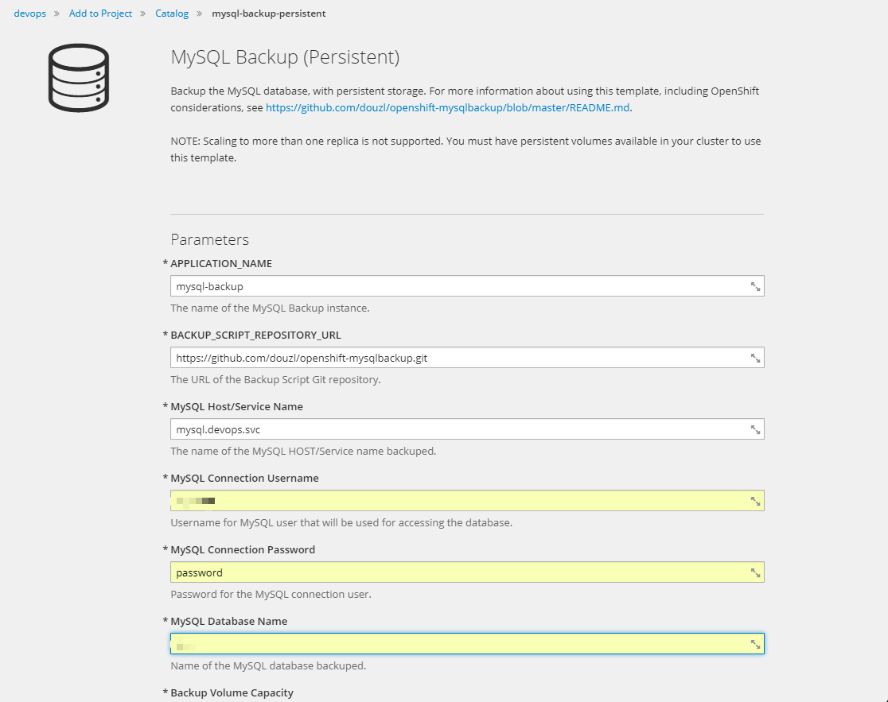
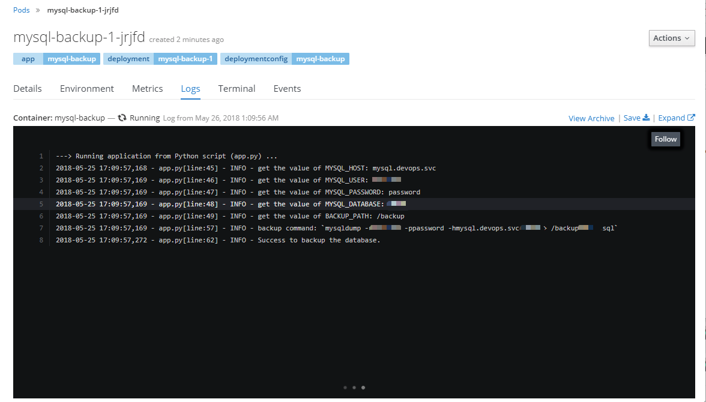

# openshift-mysqlbackup

This repostitory implements a way of making the backup of the mysql database in Openshift3.

The backup instance could be deployed by import the template json file. When running, the instance using the mysqldump command to make the mysql database data backup on the pvc created by storageclass.

## Preparing the builder image

This backup script written in python, we using the python 3.6 builder image in openshift to walk the S2I process, but there is no mariadb package instaled in the origin python 3.6 image. The Dockerfile is updated in the builder/python36-mysql/Dockerfile.

To create the builder image python36-mysql in the directory builder/python36-mysql
```
# make
```
Tag the image with your registry repostitory.
```
# docker tag python36-mysql $REGISTRY/library/python-36-mysql
```
Add python:3.6-mysql in the image stream python by the command ```oc edit is python```
```
  - annotations:
      description: Build and run Python 3.6 applications on Centos 7. For more information
        about using this builder image, including OpenShift considerations, see https://github.com/sclorg/s2i-python-container/blob/master/3.6/README.md.
      iconClass: icon-python
      openshift.io/display-name: Python 3.6 mysql
      sampleRepo: https://github.com/openshift/django-ex.git
      supports: python:3.6,python,mysql
      tags: builder,python
      version: 3.6-mysql
    from:
      kind: DockerImage
      name: harbor.ops.guizhou/library/python-36-mysql
    generation: 24
    importPolicy: {}
    name: 3.6-mysql
    referencePolicy:
      type: Source
```
Import the builder image into openshift namespace.
```
# oc import-image python --confirm --all
```

## Deploying Backup

To deploy the backup instance, from the web console select Add to project. Using Import YAML/JSON. 


Paste the content of json file template/python-mysql-backup-template.json, then click the create button.


Fill out the detail the form with the connection of mysql database.


The Application information will be display after creating.


The backup image is generated in the bc and the instance is running by the dc.


Check the pod log to get the detail of instance running.


Check the backup file in the pod ternminal.


It will make the database backup each hour by the backup script app.py.